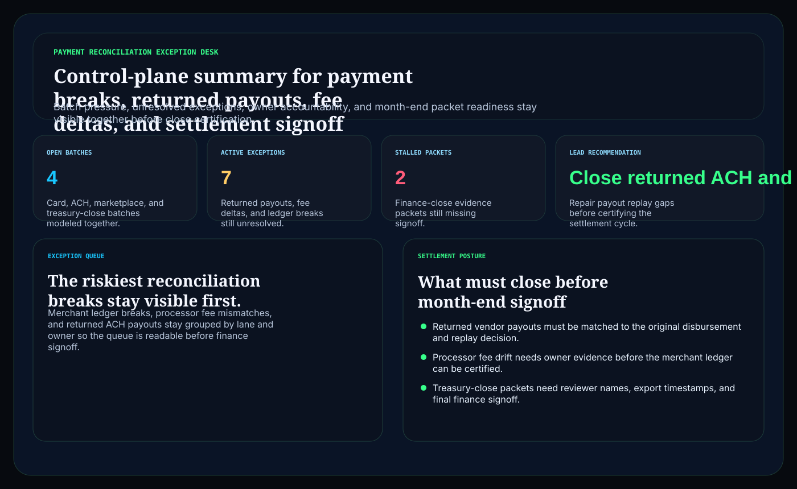
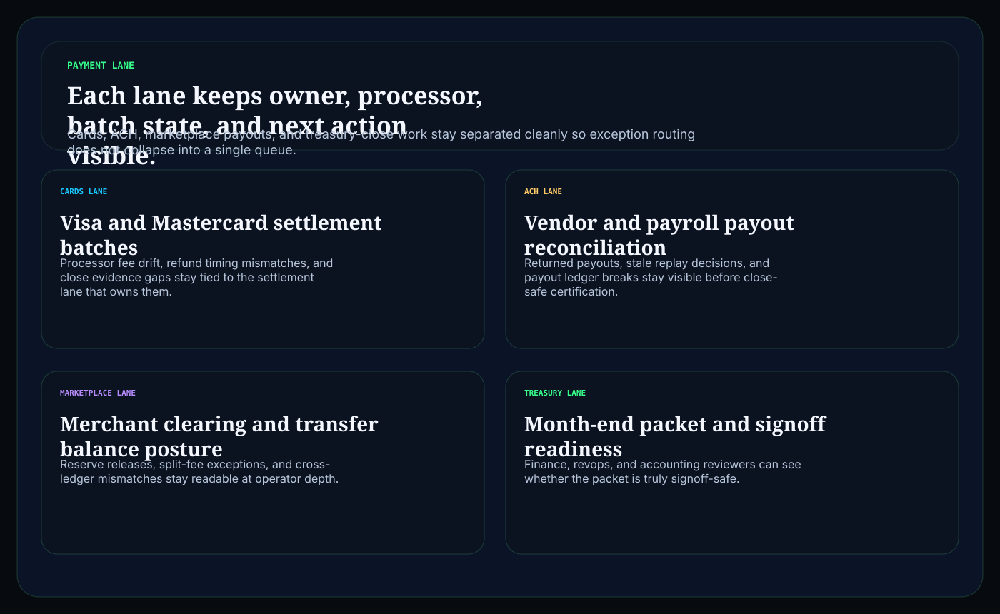
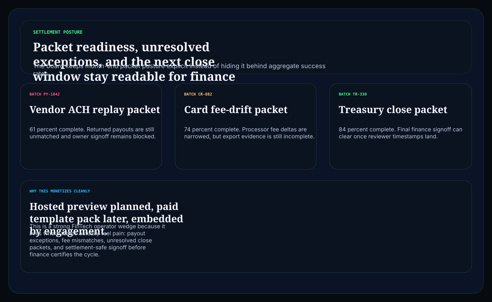

# payment-reconciliation-exception-desk

C# / ASP.NET operator surface for payment reconciliation exceptions, settlement blockers, close-safe packet readiness, and finance-safe review posture.

## Why this matters

Finance teams do not need another dashboard that says payments are healthy while ledger mismatches, returned payouts, and settlement evidence are still unresolved. They need a board that keeps batch pressure, exception routing, and close readiness visible together before month-end signoff becomes guesswork.

This repo is the public proof surface for that pattern:

- `Hosted preview planned` for a browser-based reconciliation exception desk
- `Embedded by engagement` for teams that need the routing model inside payments, treasury, or revenue operations workflows

## Product depth

Payment Reconciliation Exception Desk turns settlement noise into a close-safe decision packet. It gives finance, payment operations, treasury, revenue operations, and executive stakeholders one shared view of reconciliation evidence before gateway deltas, returned payouts, ledger breaks, or stale signoff packets create margin leakage and month-end risk.

The surface is designed for both non-technical and technical readers:

- leaders see which payment batches are unsafe to certify, what is blocking close, and where margin leakage is forming
- operators see the workflow from payment lane to exception queue to settlement posture
- technical reviewers see the data contract behind the desk: batches, exceptions, settlement packets, owner evidence, cutoff replay, and close posture
- GTM readers get a clear value story around faster close, less exception rework, cleaner settlement confidence, and fewer finance surprises

## What these repos have in common

This repo follows the Kinetic Gain control-plane pattern: convert a fragmented operating lane into a board-readable decision surface with risk, owner, proof, and next action in the same artifact.

- The public demo uses representative synthetic data, not live bank, processor, customer, merchant, credential, or production ledger data.
- The page connects business impact with implementation proof so it does not read like a generic landing page.
- The API, static export, screenshots, tests, docs, and custom-domain rail all ship from the same repo.

## Operating workflow

1. Model the payment estate: represent batches, exceptions, owners, returns, gateway deltas, and settlement packets with synthetic data.
2. Score the close posture: separate current batches, blocking exceptions, settlement risks, and close-risk evidence.
3. Route the decision: publish an operator surface showing what to certify, dispute, retry, reserve, repair, or escalate.

## What it includes

- ASP.NET Core minimal API in C#
- synthetic payment batches, reconciliation exceptions, and settlement packets
- operator surfaces for:
  - `/payment-lane`
  - `/exception-queue`
  - `/settlement-posture`
  - `/verification`
  - `/docs`
- structured JSON endpoints under `/api/*`
- static Pages export with `robots.txt`, `sitemap.xml`, and `CNAME`

## Screenshots





## Verification

- synthetic payment reconciliation and settlement evidence only
- no bank account, processor, customer, or production ledger data
- no claim of PCI DSS, SOC 1, SOC 2, ISO 27001, or compliance certification
- this is a control-plane proof surface for FinTech workflow depth, not a compliance certification claim

## Local run

```powershell
dotnet test
dotnet run --project src/PaymentReconciliationExceptionDesk.Api -- --demo
dotnet run --project src/PaymentReconciliationExceptionDesk.Api
```

Then open:

- `http://127.0.0.1:5088/`
- `http://127.0.0.1:5088/payment-lane`
- `http://127.0.0.1:5088/exception-queue`
- `http://127.0.0.1:5088/settlement-posture`

## Render static site

```powershell
dotnet run --project src/PaymentReconciliationExceptionDesk.Api -- --prerender
```

## Related docs

- [Embedded framing](./docs/KINETIC_GAIN_EMBEDDED.md)
- [Origin story](./docs/ORIGIN.md)
